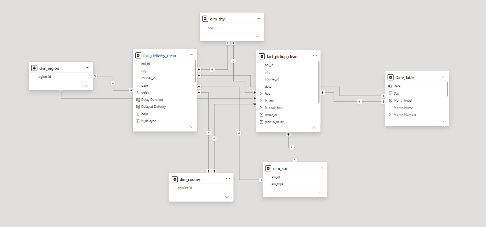
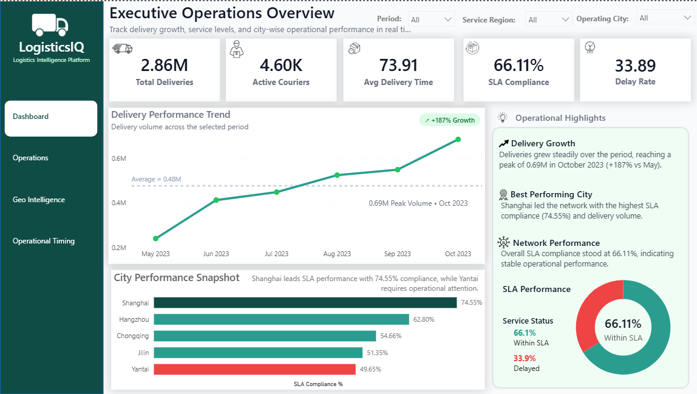
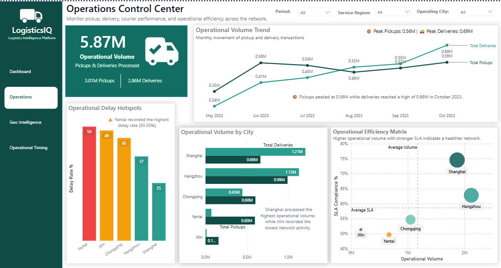
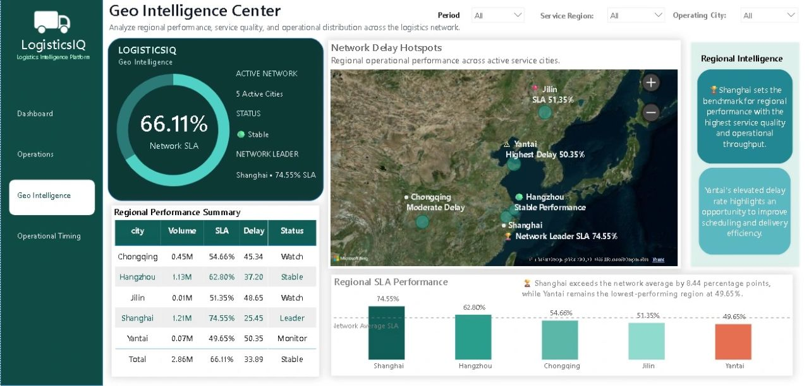
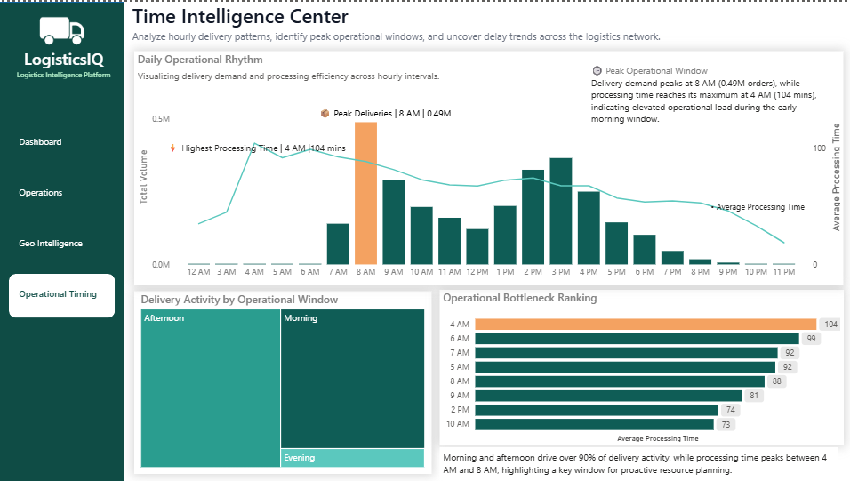

# 🚚 LogisticsIQ – Enterprise Business Intelligence Platform

> **End-to-end Business Intelligence solution transforming 5.87M logistics transactions into actionable operational intelligence using MySQL, dimensional data modeling, Power BI, and DAX.**

---

# 📌 Business Challenge

Large-scale logistics operations generate millions of pickup and delivery transactions every month across multiple cities, couriers, and operational regions.

Although operational data is readily available, fragmented reporting often makes it difficult for business teams to answer critical questions:

* Which regions consistently miss SLA targets?
* Where are operational delays concentrated?
* Which cities require immediate operational attention?
* How do pickup and delivery patterns evolve over time?
* How can multiple operational reports be consolidated into a single executive view?

Without a centralized analytics platform, monitoring performance, identifying bottlenecks, and making timely decisions becomes increasingly challenging.

---

# 💡 Solution

LogisticsIQ was designed as an enterprise Business Intelligence platform that transforms raw operational data into interactive executive dashboards.

The project follows an end-to-end analytics workflow:

**Raw Logistics Data → MySQL Preprocessing → Dimensional Data Modeling → DAX Business Logic → Interactive Power BI Dashboards → Executive Decision Support**

By integrating operational, geographical, and time-based analytics into a unified reporting experience, the solution provides a single source of truth for logistics performance.

---

# ⚙️ End-to-End Analytics Workflow

### 1. Data Preparation (MySQL)

* Cleaned and transformed raw logistics data
* Standardized operational attributes
* Prepared optimized analytical tables
* Structured data for scalable Business Intelligence reporting

### 2. Data Modeling

Designed a dimensional model consisting of:

* **2 Fact Tables**
* **5 Shared Dimension Tables**

to enable reusable business dimensions and efficient cross-dashboard analysis.

### 3. Business Intelligence

Developed interactive Power BI dashboards powered by DAX measures for executive reporting and operational monitoring.

---

# 📊 Project Scale

| Metric                       | Value     |
| ---------------------------- | --------- |
| 📊 Total Operational Records | **5.87M** |
| 🚚 Pickup Transactions       | **3.01M** |
| 📦 Delivery Transactions     | **2.86M** |
| 🌍 Service Cities            | **5**     |
| 📈 Executive Dashboard Pages | **4**     |
| 🏗 Fact Tables               | **2**     |
| 🔗 Shared Dimensions         | **5**     |

---

# 🎯 Business Impact

* ✅ Centralized **5.87 million operational records** into a unified Business Intelligence platform.
* ✅ Integrated pickup, delivery, geo intelligence, and operational timing analytics into **four interconnected executive dashboards**.
* ✅ Enabled regional SLA monitoring and city-level performance comparison through interactive reporting.
* ✅ Simplified fragmented operational reporting using a scalable dimensional data model.
* ✅ Improved visibility into delay hotspots, operational trends, and logistics network performance.
* ✅ Delivered a centralized decision-support solution for executive and operations teams.

---

# 🏗 Solution Architecture

The reporting solution follows a dimensional modeling approach designed for scalability and consistent analytics.

## Data Model

* **Fact Tables**

  * Pickup Transactions
  * Delivery Transactions

* **Shared Dimensions**

  * City
  * Region
  * Courier
  * Area of Interest (AOI)
  * Date

This architecture enables consistent filtering, reusable business dimensions, and cross-functional analysis across all dashboard modules.

---

# 📷 Dashboard Gallery

## Executive Dashboard

Provides a consolidated view of logistics KPIs, operational volume, SLA performance, and executive insights.

---

## Operations Control Center

Monitors operational efficiency through delay analysis, city performance, and service monitoring.

---

## Geo Intelligence Center

Visualizes regional performance through interactive maps, operational summaries, SLA monitoring, and location-based analytics.

---

## Operational Timing Intelligence

Analyzes pickup and delivery patterns to identify peak operational windows and time-based performance trends.

---

# 🛠 Tech Stack

| Technology                    | Purpose                       |
| ----------------------------- | ----------------------------- |
| **MySQL**                     | Data Cleaning & Preprocessing |
| **Power BI**                  | Dashboard Development         |
| **DAX**                       | Business KPIs & Calculations  |
| **Dimensional Data Modeling** | Star Schema Design            |
| **Business Intelligence**     | Executive Reporting           |
| **Data Visualization**        | Operational Insights          |

---

# 🔒 Repository Note

This project was developed as part of a Data Analytics internship.

To respect confidentiality and data privacy, the original PBIX file, datasets, SQL scripts, and proprietary business assets are not included in this repository.

This repository showcases the business problem, analytical workflow, solution architecture, dashboard design, and measurable business outcomes achieved through an enterprise Business Intelligence implementation.

---

# ⭐ Key Takeaway

**LogisticsIQ demonstrates how MySQL preprocessing, dimensional data modeling, DAX, and Power BI can transform 5.87 million logistics transactions into a centralized decision-support platform, enabling operational visibility, regional SLA monitoring, and data-driven logistics management.**
